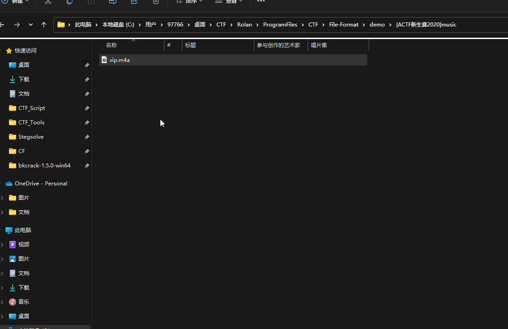
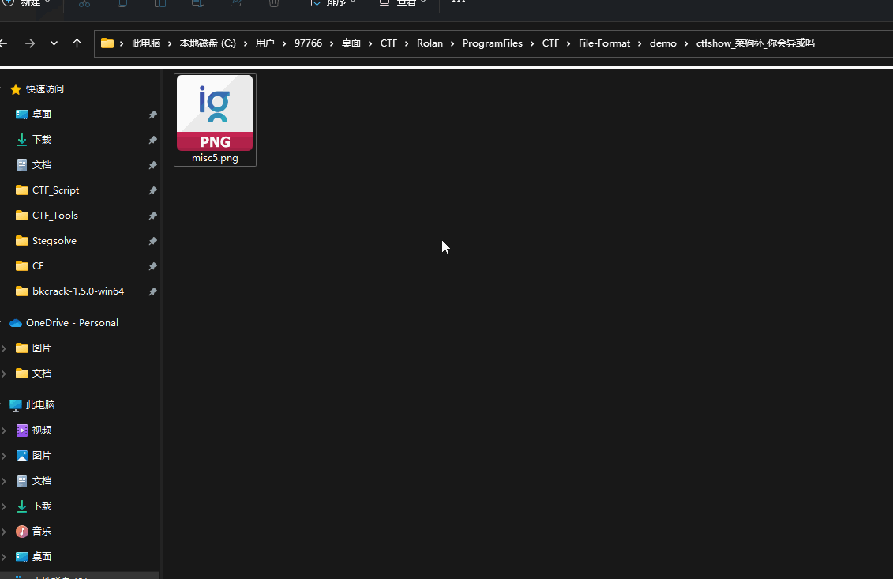
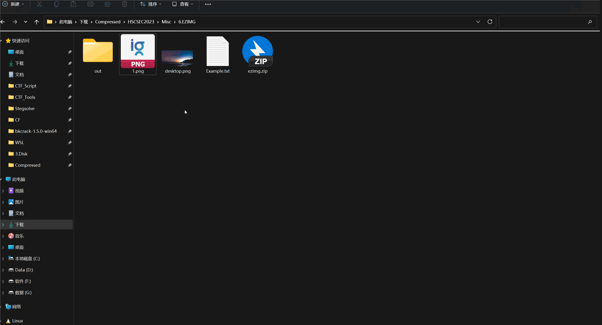

# File-Format

其实就是匹配文件头和文件尾部的字符串，然后写了一些函数，写的不咋样，凑合试试还行。关于文件头和文件尾部在`data.py`里面，可以自己再进行添加。

 

## 效果：

[ACTF新生赛2020]music

ctfshow 菜狗杯 打不开的图

ctfshow 菜狗杯 你会异或吗：

 

# File-Reverse

简单说一下，就是常用的Misc的reverse情况

## 效果：

